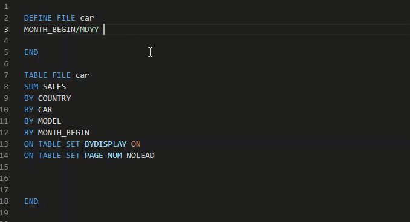
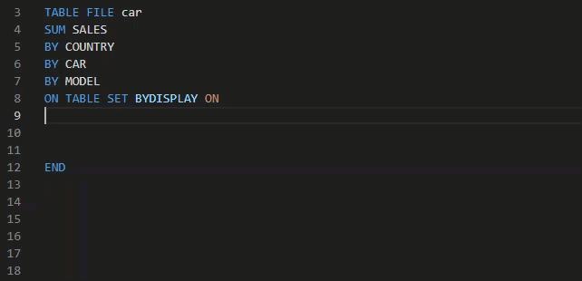
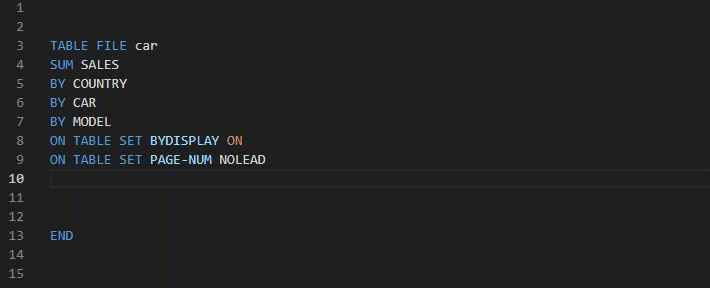
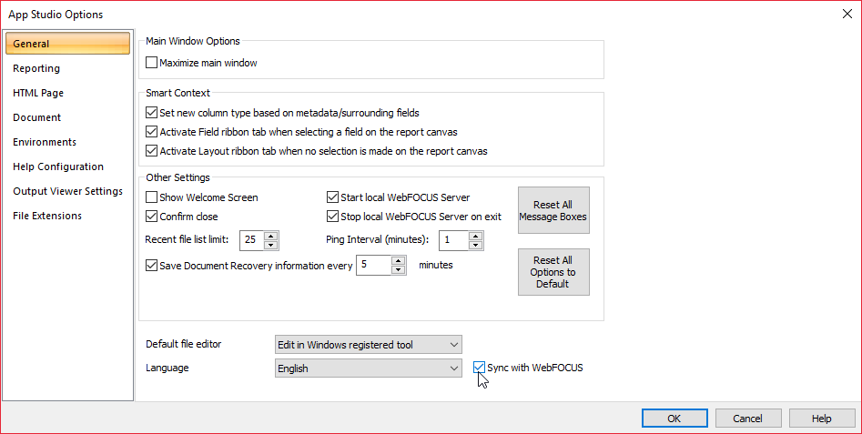

# WebFOCUS for VSCode

***Disclaimer**: This extension is neither created, maintained, nor endorsed by Information Builders. To learn more about the products WebFOCUS is used for, please visit: [https://www.informationbuilders.com/](https://www.informationbuilders.com/)*

This extension for Visual Studio Code brings support for WebFOCUS files (.fex, .sty, .mas, .acx) with syntax highlighting and code snippets. 

*Please note that the features here are available as of WebFOCUS version 8202M. Some of the functions/features may not yet be available if you are using an older version of WebFOCUS.* 

## Features

 - Syntax highlighting
 - Snippets for:
 
    - **Functions:** Type '**wff**' (WebFocus Function) and get a list of all of the built in functions available

    

    - **ON TABLE SET:** Type '**ots**' (On Table Set) *(currently a limited list)*

       

    - **Output Formats:** Type '**fmt**' (format)

       

    - **Dialog Manager Commands:** Type '-[First Letter of DM Command]'  

    - **Multiple *FILE* actions:** Type '**file**'

    - **Tracing:** Type '**trace**' *(currently only SQL Trace is available)*

    - **WHENCE:** Type '**identify**' for identifying file locations

    - **Query Commands:** Type '**wf?**' for a list of (**?**) query commands

    - **Non DM SET:** Type '**set**' *(currently a limited list)*
    
    - **Comment Block:** Type '**comment**'

## Requirements

In order to sync the changes made in VS Code to WebFOCUS, the following is required:
* Change the file associations for WebFOCUS files (.fex, .sty, .mas, .acx) on your computer to open with VSCode by default.
* Have Information Builders AppStudio installed on your PC
* Goto  AppStudio > Options > General 
    - Make sure that 'Sync with WebFOCUS' (near the bottom) is checked. 
    - You can optionally change the default file editor to 'Edit in Windows Associated Tool.' This will allow you to simply double click on a file in AppStudio and it will open the file in VS Code.

 

## Best Practices

* In VS Code goto File and select Auto Save to automatically save changes to WebFOCUS.
* Open the file that you are editing in a browser through the web interface. Then you can just refresh the web page to see the changes instead of having to go to AppStudio and right-click > run

## Known Issues

Please use the [Issues tab](https://github.com/steebn/WebFOCUS-VSCode/issues) to report any issues or to make any feature requests. 

## Release Notes

Releases Notes can be found in the [changelog](https://github.com/steebn/WebFOCUS-VSCode/blob/master/CHANGELOG.md).
 
----------
